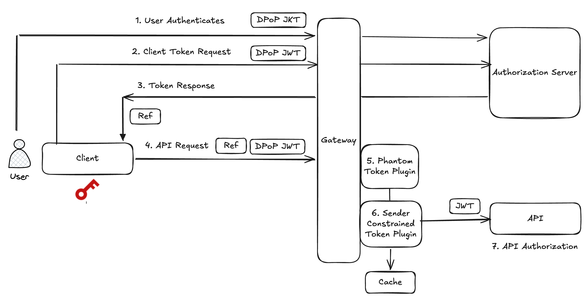

# DPoP End to End

[](https://curity.io/resources/code-examples/status/)
[](https://curity.io/resources/code-examples/status/)

An end-to-end example that demonstrates DPoP mechanics for clients and APIs.

## DPoP Flow

The following diagram illustrates an example deployment for a high security API and an internet client.  



The DPoP client is a console application that uses a crypto library to create a keypair for DPoP.  
The client then triggers a DPoP flow with the following steps:

1. During user authentication, the client sends a `dpop_jkt` parameter in its authorization request, with the thumbprint of its DPoP signing key.
2. The client sends a DPoP proof JWT in its token request, whose public key must match that sent earlier in the `dpop_jkt` parameter.
3. The client receives an opaque access token.
4. The client calls an API with the opaque access token and also sends a fresh DPoP proof.
5. The API gateway uses the <CrossRef file="phantom-token-pattern.mdx">Phantom Token Pattern</CrossRef> to introspect the opaque access token and get a sender-constrained JWT access token.
6. The API gateway runs a sender-constrained token plugin to implement DPoP proof of possession, with the help of a cache.
7. API developers receive a JWT access token, validate it and use its claims for business authorization.

If a malicious party somehow intercepts a leaked access token, they will be unable to use it to gain API access.   
To do so, the malicious party would need the genuine client's cryptographic key as well as its access token.

## Run the Deployment

First, provide an environment variable that points to a license file for the Curity Identity Server.  
If required, download a license file from the [Curity Developer Portal](https://developer.curity.io/).

```bash
export LICENSE_FILE_PATH=~/Desktop/license.json
```

Run a build script to produce custom Docker images, and then deploy the Curity Identity Server, an API gateway and an example API:

```bash
./build.sh
./deploy.sh
```

Add the following domain names to your local computer's `/etc/hosts` file.  
Also trust the root SSL certificate at `gateway/certs/example.ca.crt`, e.g. by adding it to the system keychain on macOS.  

```text
127.0.0.1 admin.demo.example login.demo.example api.demo.example
```

The deployment then provides OAuth and API endpoints.  
For example, you can log in to the Admin UI for the Curity Identity Server with the following commands:

- URL: `https://admin.demo.example/admin`
- Username: `admin`
- Password: `Password1`

## Run the DPoP Flow

Run a console application that acts as a DPoP client, to call APIs with sender-constrained access tokens:

```bash
cd dpop-client
npm install
npm start
```

The client triggers user authentication and for demo purposes you can sign in by just entering a username.  
The client then receives an opaque access tokens and outputs it for visualization purposes:

```bash
Received opaque access token: _0XBPWQQ_5557c7ae-f50c-4fd7-a8ae-33ec7dcf3445
```

A real internet client should not be able to view the JWT access token that corresponds to the opaque access token.  
For visualization purposes, the DPoP client uses API gateway permissions to introspect the opaque access token.  
The client can therefore output a JWT access token, and you can view the token's claims.  
The `cnf` claim is a JWT thumbprint of the client's DPoP public key.  

```json
{
  "jti": "bf30b56d-56e3-4c19-86f8-12c27f277dbd",
  "delegationId": "ac10ce35-05b1-45cb-b291-8169b6b8bbc9",
  "exp": 1787066361,
  "nbf": 1787065461,
  "scope": "openid profile retail/orders",
  "iss": "https://login.demo.example/oauth/v2/oauth-anonymous",
  "sub": "johndoe",
  "aud": [
    "dpop-client",
    "https://api.demo.example/orders"
  ],
  "iat": 1787065461,
  "purpose": "access_token",
  "cnf": {
    "jkt": "eywqMwZfUtgXL9e-2Cn7sqc7W0B2Dfy_RUAeSf1RkfE"
  },
  "customer_id": "102"
}
```

The client then sends its access token to the Curity Identity Server's OpenID Connect userinfo endpoint.  
The client sends the access token in the HTTP `Authorization: DPoP` header.  
The client also sends a DPoP proof JWT in the HTTP `DPoP` header.  
The DPoP proof JWT must include a server-provided nonce and a hash of the opaque access token.  
The request is then authorized and the client receives a userinfo response:

```json
{
  "sub": "johndoe"
}
```

The client then calls its own APIs in the same way, and the API gateway implements DPoP resource server security:

- The API gateway introspects the opaque access token to get a JWT access token.
- The API gateway implements multiple DPoP validation checks and returns server-provided nonces when required.
- The API gateway then forwards the JWT access token to the API, which treats it as a bearer token.
- The API validates the JWT access token and implements business authorization using access token claims.

After all security checks pass, the client receives authorized data from the API:

```json
[
  {
    "customerId": "102",
    "productId": "XM0922",
    "amountUSD": 30000
  },
  {
    "customerId": "102",
    "productId": "LK9834",
    "amountUSD": 45000
  }
]
```

## DPoP Resource Server Implementation

The main part of the deployment is a demo-level [dpop-sender-constrained Lua plugin](gateway/dpop-sender-constrained-plugin/access.lua).  
The plugin requires ES256 DPoP proof JWTs and uses a Redis cache.  
The plugin performs the following main tasks:

- It implements [DPoP Proof Verification](https://datatracker.ietf.org/doc/html/rfc9449#section-4.3).
- It implements [JWK Thumbprint Confirmation](https://datatracker.ietf.org/doc/html/rfc9449#name-public-key-confirmation) to verify the JWT access token's `jkt` claim.
- It verifies that the DPoP proof's `ath` claim is bound to the opaque access token.  
- It uses [Resource Server-Provided Nonces](https://datatracker.ietf.org/doc/html/rfc9449#name-resource-server-provided-no) to ensure fresh DPoP proof JWTs.
- It protectsw against [DPoP Proof Replay](https://datatracker.ietf.org/doc/html/rfc9449#section-11.1) by caching `jti` claims.

## Further Information

- Please visit [curity.io](https://curity.io/) for more information about the Curity Identity Server.
- See the [DPoP Overview](https://curity.io/resources/learn/dpop-overview/) to learn how Demonstrating Proof of Possession works and when to use it.
- See the [DPoP End-to-End Code Example](https://curity.io/resources/learn/dpop-secured-api) to learn more about this code example.s
